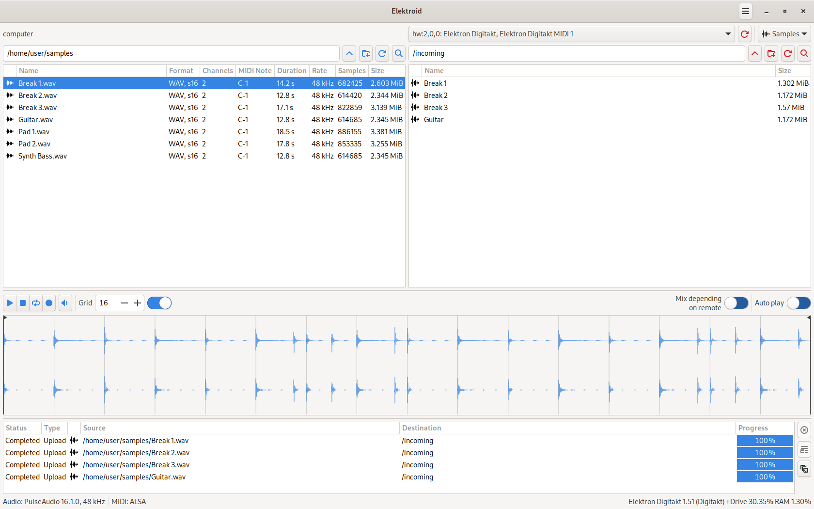

Elektroid is a sample and MIDI device manager. It includes the `elektroid` GUI application and the `elektroid-cli` CLI application.

Elektroid started as a FLOSS Elektron Transfer alternative and it has ended up supporting other devices from different vendors in the same fashion.

These are the supported devices:

* Elektron Model:Samples
* Elektron Model:Cycles
* Elektron Digitakt I and II
* Elektron Digitone and Digitone Keys
* Elektron Syntakt
* Elektron Analog Rytm MKI and MKII
* Elektron Analog Four MKI, MKII and Keys
* Elektron Analog Heat MKI, MKII and +FX
* All samplers implementing MIDI SDS
* Casio CZ-101
* Arturia MicroBrute
* Arturia MicroFreak
* Eventide ModFactor, PitchFactor, TimeFactor, Space and H9
* Moog Little Phatty and Slim Phatty
* Novation Summit and Peak

While Elektroid is already available in some GNU/Linux distributions such as Debian or Ubuntu, it can also be easily installed on other distributions via Flatpak.
