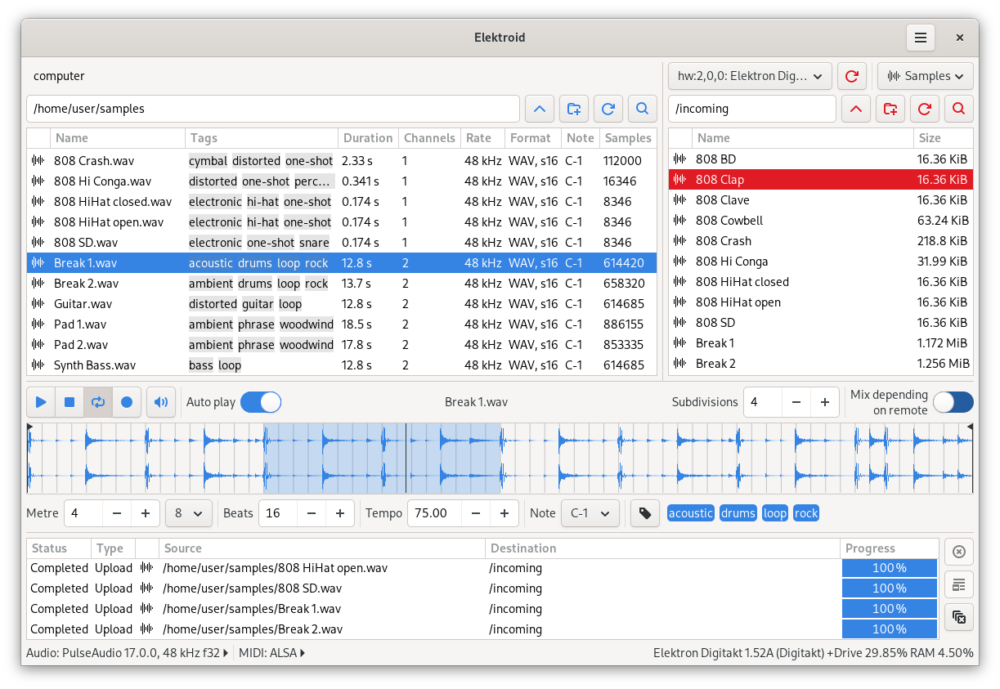

Elektroid is a sample and MIDI device manager. It includes the `elektroid` GUI application and the `elektroid-cli` CLI application.

Elektroid started as a FLOSS Elektron Transfer alternative and it has ended up supporting other devices from different vendors in the same fashion.

These are the supported devices:

* Arturia MicroBrute
* Arturia MicroFreak
* Casio CZ-101
* Elektron Analog Four MKI, MKII and Keys
* Elektron Analog Heat MKI, MKII and +FX
* Elektron Analog Rytm MKI and MKII
* Elektron Digitakt I and II
* Elektron Digitone I and II and Digitone Keys
* Elektron Model:Cycles
* Elektron Model:Samples
* Elektron Syntakt
* Eventide ModFactor, PitchFactor, TimeFactor, Space and H9
* KORG padKONTROL
* KORG Volca Sample and Volca Sample 2
* Moog Little Phatty and Slim Phatty
* Novation Summit and Peak
* Samplers implementing MIDI SDS

Other interesting features are:

* Autosampler with SFZ file generation
* Sample playback, recording and basic edition
* Sample loop points edition
* Sample tagging
* Sample zoom
* Search within devices
* SysEx transmission and reception

While Elektroid is already available in some GNU/Linux distributions such as Debian or Ubuntu, it can also be easily installed on other distributions via Flatpak.
